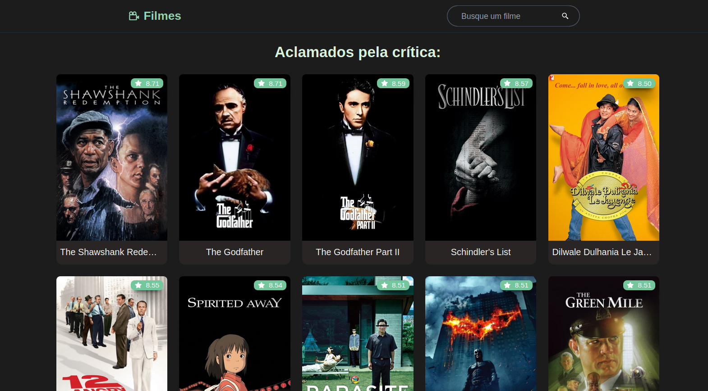
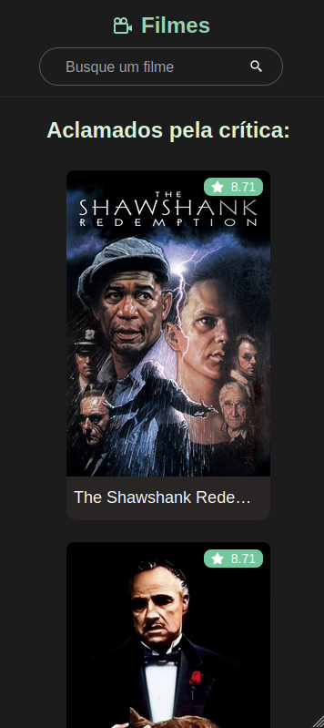
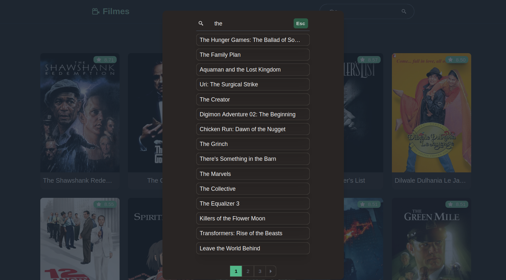
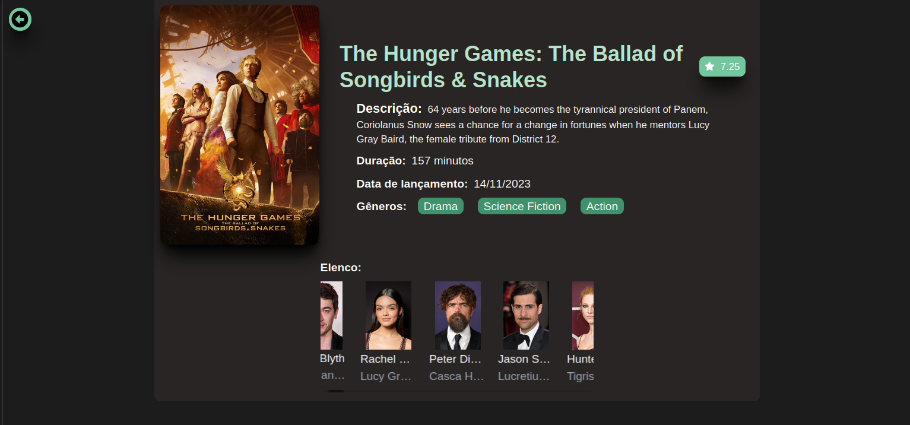
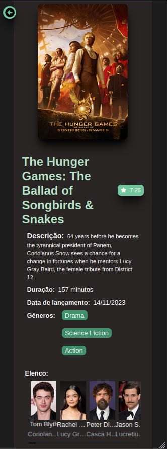

# Cine-Explore: Catálogo de Filmes
## Descrição do Projeto

O Cine-Explore é um catálogo de filmes desenvolvido utilizando o framework Next.js. Esta aplicação permite aos usuários buscar filmes, explorar informações sobre o elenco e obter diversos detalhes sobre cada produção cinematográfica. O projeto foi desenvolvido com foco na facilidade de uso e na apresentação de informações relevantes aos amantes do cinema.
Principais Funcionalidades

    - Busca de Filmes: Realize pesquisas por título para encontrar seus filmes favoritos.
    - Detalhes do Filme: Obtenha informações detalhadas sobre cada filme, incluindo elenco, sinopse e muito mais.
    - Responsividade: O Cine-Explore é completamente responsivo, proporcionando uma experiência consistente em dispositivos móveis, tablets e desktops.

## Tecnologias Utilizadas

    - Next.js: O projeto foi desenvolvido utilizando Next.js, proporcionando uma experiência de desenvolvimento eficiente e otimizada para SEO.
    - Jest (Testes Unitários): Foram implementados testes unitários utilizando Jest, garantindo a confiabilidade e qualidade do código.
    - Cypress (Testes E2E): Os testes end-to-end foram realizados com Cypress, assegurando o funcionamento adequado das funcionalidades em um ambiente integrado.
    - Tailwind CSS: O Cine-Explore utiliza Tailwind CSS para uma estilização eficiente e fácil manutenção.
    - Arquitetura DDD (Domain-Driven Design): A aplicação foi estruturada seguindo os princípios de Domain-Driven Design, visando uma arquitetura modular e escalável.

# Telas
### Home

---- 

### Pesquisa

### Detalhes dos filmes

---

# Como Executar o Projeto Localmente

### Clonar Repositório:
    
    git clone https://github.com/seu-usuario/cine-explore.git

### Instalar Dependências:

    cd cine-explore
    npm install

### Rodar Aplicação:

    npm run dev

    Acesse http://localhost:3000 em seu navegador.

### Testes Unitários (Jest)

    npm run test
    npm run cypress

---
### Igor Gabriel Martins Ramos